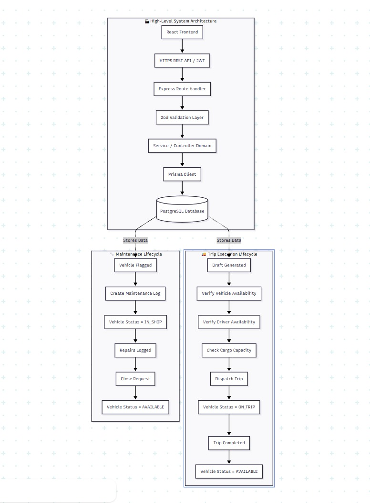
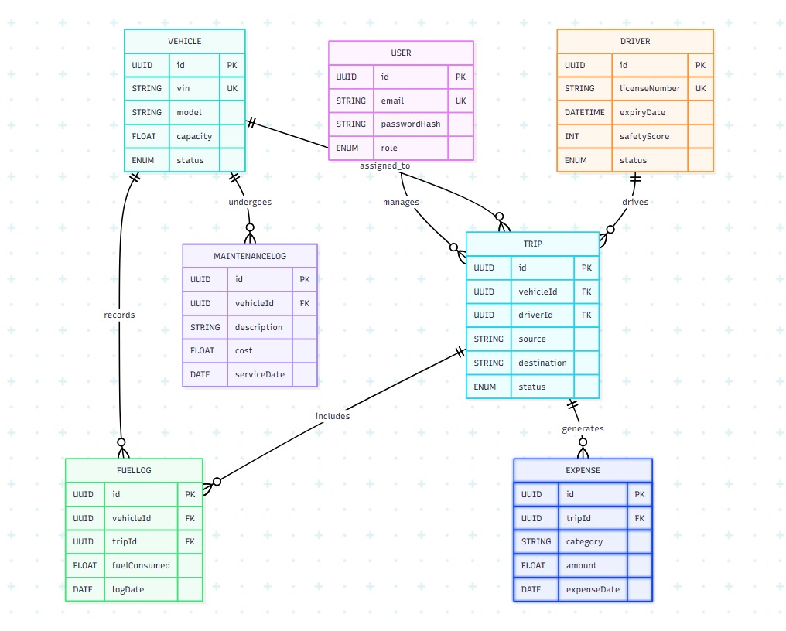

# LogiFleet: Enterprise Fleet & Logistics Management System

LogiFleet is a full-stack fleet management platform designed to digitize asset lifecycle workflows, dispatch logic, operational compliance, and cost accounting. Built with React, Node.js, Express, Prisma ORM, and PostgreSQL, the platform replaces fragmented manual tracking systems with a unified, role-based REST API and intuitive management interface.

---

## Table of Contents

- [Overview](#overview)
- [Problem Statement](#problem-statement)
- [Architecture & Design Decisions](#architecture--design-decisions)
- [Key Features](#key-features)
- [Role-Based Access Control (RBAC)](#role-based-access-control-rbac)
- [Technology Stack](#technology-stack)
- [System Architecture & Workflows](#system-architecture--workflows)
- [Database Architecture](#database-architecture)
- [API Specification](#api-specification)
- [Security & Validation](#security--validation)
- [Performance Optimization](#performance-optimization)
- [Directory Structure](#directory-structure)
- [Roadmap](#roadmap)
- [Contributors & License](#contributors--license)

---

## Overview

Modern fleet operations require precise coordination across asset management, driver scheduling, preventive maintenance, fuel auditing, and financial accounting. Organizations relying on spreadsheets and legacy software frequently run into operational bottlenecks, compliance risks, and untracked financial leakages.

LogiFleet consolidates core logistics functions into a single system. It ensures that trip dispatches adhere strictly to capacity limits and driver compliance, tracks vehicle state transitions, logs operational expenses, and provides actionable business metrics.

---

## Problem Statement

Logistics operators encounter several systemic challenges without integrated management tools:

1. **Unstructured Asset Tracking:** Vehicle status, maintenance history, and assignment records stored in disparate sheets lead to poor utilization visibility.
2. **Compliance & Driver Risk:** Inability to dynamically enforce driver license validity checks, safety scores, and duty hour restrictions prior to trip dispatch.
3. **Unmonitored Maintenance Schedules:** Reactive maintenance practices increase operational downtime, road failure risks, and long-term asset depreciation.
4. **Expense Accounting Gaps:** Fuel logs and trip expenses without strict foreign-key linkage to specific trips or assets result in unchecked operational costs.
5. **Lack of Auditable Security:** Systems without fine-grained access control expose operational and financial data to unauthorized access.

---

## Architecture & Design Decisions

LogiFleet follows a decoupled, layered client-server model designed for scalability, maintainability, and predictable performance:

```text
[ React SPA Frontend ]
       │  (HTTPS / JWT)
       ▼
[ Node.js + Express API Engine ]
       │
       ├── Middleware (Auth Authentication, RBAC Guard, Input Validation)
       │
       ├── Service / Controller Layer (Business Logic)
       │
       └── Prisma ORM (Type-Safe Query Layer)
               │
               ▼
      [ PostgreSQL Engine ]
  ```


  ### Key Architectural Standards

* **Decoupled API Layer:** Clear separation between controller handlers and core service logic simplifies testing and maintenance.
* **Strict Runtime Validation:** Request payloads are validated at the API route boundary before hitting controller or service code.
* **Type Safety:** Schema definitions in Prisma generate static types across the application, reducing runtime type errors.
* **Soft Deletion Pattern:** Core entities preserve historical and audit trail compliance using logical soft-delete flags rather than hard SQL deletions.

---

## Key Features

* **Authentication & Identity:** Stateless, short-lived JSON Web Token (JWT) issuing backed by `bcrypt` password hashing.
* **Granular RBAC:** Route-level middleware enforcing permissions across operational roles (`MANAGER`, `DRIVER`, `SAFETY`, `ANALYST`).
* **Asset Lifecycle Engine:** Vehicle inventory state machine handling state transitions (`AVAILABLE`, `ON_TRIP`, `IN_SHOP`, `RETIRED`).
* **Driver Management:** Tracking of license numbers, expiration dates, safety ratings, and current duty status.
* **Validated Trip Dispatch:** Pre-dispatch validation verifying vehicle capacity, driver availability, cargo weight compliance, and license validity.
* **Maintenance & Expense Logs:** Isolated logging domains tied directly to specific vehicles and trips for cost attribution.
* **Operational Reporting:** Real-time metrics calculations and structured CSV generation for financial and operational analysis.

---

## Role-Based Access Control (RBAC)

Access permissions are enforced strictly via server-side middleware based on authenticated user roles:

| Action / Capability | Fleet Manager | Driver | Safety Officer | Financial Analyst |
| :--- | :---: | :---: | :---: | :---: |
| **Manage Vehicles (Create/Edit)** | Yes | No | No | No |
| **Soft Delete Assets** | Yes | No | No | No |
| **Manage Driver Profiles** | Yes | No | Yes | No |
| **Manage Driver License Status** | No | No | Yes | No |
| **Create & Dispatch Trips** | Yes | Yes | No | No |
| **Log Fuel & Operational Expenses** | Yes | Yes | No | No |
| **Access Financial Analytics** | Yes | No | No | Yes |
| **Export Operational Datasets** | Yes | No | No | Yes |

---

## Technology Stack

### Frontend Architecture
* **UI Framework:** React with Vite build tooling
* **Styling:** Tailwind CSS
* **HTTP Client:** Axios with dynamic request/response interceptors
* **Data Visualization:** Recharts

### Backend Architecture
* **Runtime Environment:** Node.js
* **Web Framework:** Express.js
* **Database ORM:** Prisma ORM
* **Input Validation:** Zod
* **Authentication:** JSON Web Tokens (`jsonwebtoken`) & `bcrypt`

### Database Engine
* **Database Engine:** PostgreSQL

---

## System Architecture & Workflows

### High-Level Architecture Diagram



### Core Operational Workflows

#### 1. Trip Execution Lifecycle
```text
[Draft Created] ──► [Validate Driver & Vehicle Rules] ──► [Dispatched (ON_TRIP)] ──► [Completed (AVAILABLE)]
```

```text
[Vehicle Flagged] ──► [Create Maintenance Ticket (IN_SHOP)] ──► [Repairs Logged] ──► [Close Ticket (AVAILABLE)]
```

#### 2. Maintenance Lifecycle
```text
[Vehicle Flagged] ──► [Create Maintenance Ticket (IN_SHOP)] ──► [Repairs Logged] ──► [Close Ticket (AVAILABLE)]
```

---

## Database Architecture

LogiFleet utilizes a relational PostgreSQL architecture managed dynamically with type-safe execution via Prisma ORM.

### Entity Relationship Diagram



### Schema Models & Entities

* **User**: `id` (UUID, PK) | `email` (String, Unique) | `passwordHash` (String) | `role` (Enum: `MANAGER`, `DRIVER`, `SAFETY`, `ANALYST`)
* **Vehicle**: `id` (UUID, PK) | `vin` (String, Unique) | `model` (String) | `capacity` (Float) | `status` (Enum: `AVAILABLE`, `ON_TRIP`, `IN_SHOP`, `RETIRED`)
* **Driver**: `id` (UUID, PK) | `licenseNumber` (String, Unique) | `expiryDate` (DateTime) | `safetyScore` (Int) | `status` (Enum: `AVAILABLE`, `ON_TRIP`, `OFF_DUTY`, `SUSPENDED`)
* **Trip**: `id` (UUID, PK) | `vehicleId` (FK) | `driverId` (FK) | `source` (String) | `destination` (String) | `status` (Enum: `DRAFT`, `DISPATCHED`, `COMPLETED`, `CANCELLED`)
* **FuelLog / MaintenanceLog / Expense**: Foreign-key linked directly to `Vehicle` and `Trip` models for aggregate financial cost attribution.

---

## API Specification

### Authentication Domain
* `POST /api/v1/auth/register` — Create a new enterprise account.
* `POST /api/v1/auth/login` — Validate credentials and issue JWT signature.
* `GET  /api/v1/auth/me` — Retrieve active profile session payload.

### Fleet & Assets Domain
* `GET    /api/v1/vehicles` — Paginated index of vehicles with status and region filters.
* `POST   /api/v1/vehicles` — Register a new vehicle entity *(Manager only)*.
* `PATCH  /api/v1/vehicles/:id` — Dynamically update vehicle state or specs.
* `DELETE /api/v1/vehicles/:id` — Perform a soft-delete on a vehicle asset.

### Logistics & Operations Domain
* `POST /api/v1/trips` — Initialize a draft trip record.
* `POST /api/v1/trips/:id/dispatch` — Validate compliance rules and switch trip status to `DISPATCHED`.
* `POST /api/v1/trips/:id/complete` — Conclude trip, capture final odometers, and restore asset statuses to `AVAILABLE`.

---

## Security & Validation

### Request Validation
Incoming REST request payloads are validated at the route boundary using Zod runtime schemas.

#### Dispatch Validation Rule Logic
To successfully dispatch a trip, the service engine validates state constraints according to the following condition:

Dispatch Valid = (Driver Available) AND (Vehicle Available) AND (License Valid) AND (Cargo Weight <= Vehicle Capacity)

### Middleware Pipeline
* **JWT Extractor:** Decodes signature headers and attaches the verified user context to request objects.
* **RBAC Guard:** Checks the active session scope against specified route permission lists.
* **Error Interceptor:** Handles application exceptions gracefully without exposing raw database exceptions.

---

## Performance Optimization

* **Database Indexing:** Compound indexes applied on frequently filtered query fields (`vehicleId`, `driverId`, `status`).
* **Selective Subquery Projection:** Queries explicitly request needed field sets to minimize payload overhead and prevent unnecessary full-table scans.
* **Soft Delete Middleware:** Global query extensions exclude soft-deleted entities automatically from standard queries.
* **Server Caching Engine:** Strategic query caching layer reduces execution latency on high-frequency analytics and KPI calls.

---

## Directory Structure

```text
LogiFleet/
├── client/                     # Frontend SPA Layer
│   ├── src/
│   │   ├── components/         # Reusable UI Components
│   │   ├── pages/              # Main Application Views
│   │   ├── services/           # Axios Client API Services
│   │   └── routes/             # RBAC Guarded Route Setup
│   └── package.json
└── server/                     # Express REST Engine
├── controllers/            # Route Handlers
├── services/               # Core Business Logic
├── middleware/             # Authentication & Validation Guards
├── validators/             # Zod Validation Specs
├── prisma/                 # ORM Schema & Migration History
└── package.json
```
---

## Roadmap

- [ ] **GPS Telematics Integration:** Continuous location updates using real-time GPS telemetry streams.
- [ ] **Automated Geofencing:** System-generated alerts on route deviations or unauthorized stops.
- [ ] **Predictive Maintenance ML:** Machine-learning models predicting component wear derived from historical usage patterns.
- [ ] **Driver Mobile Application:** Native companion app for drivers with OCR receipt processing and route navigation.

---

## Contributors & License

### Contributors
* **Jaspreet Kaur** — Data Architecture & API Lead
* **Manan Bansal** — Authentication & Validation Pipeline Engineer
* **Simran Maurya** — State Management & Core View Architect
* **Maninder Saini** — Visualization UI & Responsive Interface Engineer

### License
This project is open-source software licensed under the terms of the [MIT License](LICENSE).
