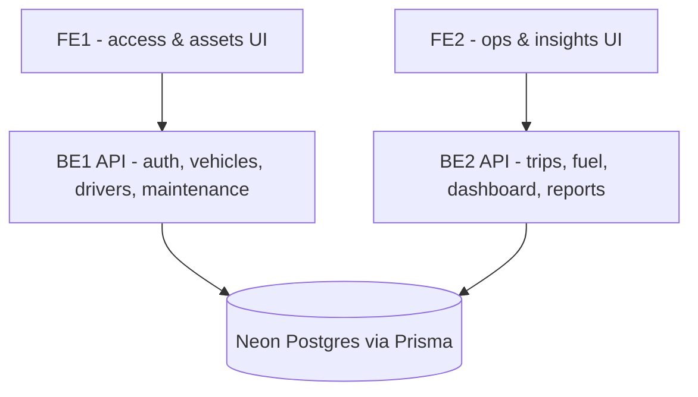
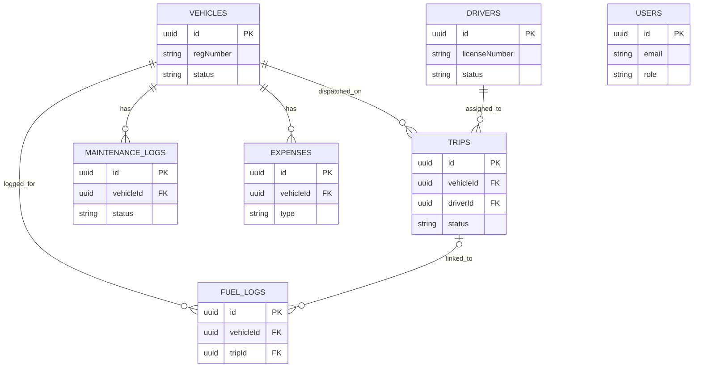

# TransitOps — implementation guide

Smart Transport Operations Platform. 8-hour hackathon build, 4-person team, React + Express + PostgreSQL (Neon) + Prisma.

This is the master doc — it ties the pieces together and points at the two detailed reference files (`prisma/schema.prisma`, `docs/API_CONTRACT.md`) rather than duplicating them.

---

## 1. Repo structure

```
transitops/
├── client/                 # React (Vite) — FE1 + FE2
│   └── src/
├── server/                 # Express — BE1 + BE2
│   ├── prisma/
│   │   └── schema.prisma
│   └── src/
│       ├── routes/
│       ├── services/       # business rules + transactions live here
│       └── middleware/     # auth, RBAC
├── docs/
│   ├── API_CONTRACT.md
│   └── implementation.md   # this file
└── README.md
```

## 2. Team & module ownership

Four people, two vertical slices — not "frontend team" and "backend team." Each pair owns a slice end to end and shouldn't block on the other pair.

| Person | Owns | Notes |
|---|---|---|
| **BE1** | Auth/RBAC · Vehicle Registry · Driver Management · Maintenance | Mostly CRUD + one status side-effect. Build first — everything else references vehicles/drivers. |
| **BE2** | Trip Management · Fuel/Expense · Dashboard KPIs · Reports & Analytics | Heaviest module: trip state machine, dispatch validation, cost/ROI aggregation. Give it your strongest backend dev. |
| **FE1** | Login/signup, RBAC route guards, Vehicle Registry UI, Driver Management UI, Maintenance UI | Consumes only BE1's endpoints. |
| **FE2** | Dashboard, Trip Management UI, Fuel/Expense logging UI, Reports/Analytics + CSV export | Consumes only BE2's endpoints. |

**First 30 minutes, all four together:** lock the DB schema and the API response envelope before anyone writes code. FE1/FE2 then build against mocked JSON matching that contract while BE1/BE2 build the real thing — swap mocks for live APIs at the integration checkpoint, not before.

## 3. System architecture



## 4. Data model

Source of truth: `server/prisma/schema.prisma`. Condensed ERD for reference:



**Two documented deviations from the spec's entity list (section 6), both deliberate:**

1. **`Roles` collapsed into a `Role` enum on `User`**, instead of a separate `Roles` table. The four roles are fixed for this build — a join table buys you nothing today and costs you a migration.
2. **Added `Trip.revenue`**, not in the original entity list. Required to compute Vehicle ROI (`(Revenue − (Maintenance + Fuel)) / Acquisition Cost`, spec section 3.8) — there was no other field carrying revenue anywhere in the spec.

## 5. API surface (condensed)

Full request/response shapes, error codes, and per-endpoint role rules: **`docs/API_CONTRACT.md`**.

| Owner | Endpoints |
|---|---|
| BE1 | `POST /auth/register`, `POST /auth/login`, `GET /auth/me` |
| BE1 | `GET/POST/PATCH/DELETE /vehicles`, `GET /vehicles/available` |
| BE1 | `GET/POST/PATCH /drivers`, `GET /drivers/available` |
| BE1 | `GET/POST /maintenance`, `PATCH /maintenance/:id/close` |
| BE2 | `GET/POST /trips`, `POST /trips/:id/dispatch`, `/complete`, `/cancel` |
| BE2 | `GET/POST /fuel-logs`, `GET/POST /expenses` |
| BE2 | `GET /dashboard/kpis` |
| BE2 | `GET /reports/vehicle/:id`, `/reports/fleet-summary`, `/reports/export.csv` |

## 6. Business rules → implementation mapping

Every rule below comes from spec section 4. This table is the one BE1/BE2 should work from directly.

| Rule | Enforced in | Mechanism |
|---|---|---|
| Vehicle `regNumber` must be unique | DB | `@unique` constraint — Postgres rejects the insert, service layer maps it to `409 CONFLICT` |
| Retired/In Shop vehicles never appear in dispatch | BE1 | `GET /vehicles/available` filters `status = AVAILABLE` — this endpoint is the only one FE2 should use to populate the trip form |
| Expired-license or suspended drivers can't be assigned | BE2 | Dispatch validation checks `licenseExpiry` and `status` before allowing `POST /trips/:id/dispatch` |
| A vehicle/driver already `ON_TRIP` can't be assigned again | BE2 | Same dispatch validation, `409 CONFLICT` if either is already `ON_TRIP` |
| Cargo weight ≤ vehicle max load capacity | BE2 | Checked at `POST /trips` (creation), re-checked at dispatch in case the vehicle changed |
| Dispatch flips vehicle + driver to `ON_TRIP` | BE2 | Single DB transaction across `trip`, `vehicle`, `driver` rows — never three separate writes |
| Complete flips vehicle + driver back to `AVAILABLE` | BE2 | Same transaction pattern, also writes `vehicle.odometer` |
| Cancel restores `AVAILABLE` if the trip was dispatched | BE2 | Same transaction pattern, conditional on prior status |
| Creating a maintenance record sets vehicle to `IN_SHOP` | BE1 | Transaction inside `POST /maintenance` |
| Closing maintenance restores `AVAILABLE` unless retired | BE1 | Transaction inside `PATCH /maintenance/:id/close`, guarded by a check on current status |

**Race condition note:** two people can hit dispatch on the same vehicle at nearly the same time. Use `SELECT ... FOR UPDATE` on the vehicle and driver rows inside the dispatch transaction so the second request sees the already-updated status and gets a clean `409`, instead of both requests succeeding.

## 7. Environment variables

```bash
# server/.env
DATABASE_URL=postgresql://<neon-connection-string>
JWT_SECRET=<any-long-random-string>
PORT=5000

# client/.env
VITE_API_BASE_URL=http://localhost:4000/api
```

## 8. Local setup

```bash
# server
cd server
npm install
npx prisma generate
npx prisma db push        # pushes schema.prisma to Neon
npm run dev

# client
cd client
npm install
npm run dev
```

Seed data: write a small `prisma/seed.ts` with 2-3 vehicles, 2-3 drivers, and one completed trip so the dashboard and reports aren't empty during the demo. Do this at hour 1, not hour 7.

## 9. 8-hour timeline

| Time | What happens |
|---|---|
| 0:00–0:30 | All four: lock schema, API contract, review the Excalidraw mockup |
| 0:30–1:00 | Setup: Neon DB provisioned, Prisma pushed, Express + React skeletons, deploy pipeline wired (even empty) |
| 1:00–4:00 | Parallel build: FE1+BE1 on auth/vehicles/drivers/maintenance; FE2+BE2 on trips/fuel |
| 4:00–4:30 | **Checkpoint 1** — swap FE mocks for real APIs, fix contract mismatches |
| 4:30–6:30 | Dashboard KPIs, reports/analytics, cargo/license/status validations, edge cases |
| 6:30–7:00 | **Checkpoint 2** — run the acceptance test in section 10 end to end |
| 7:00–7:30 | Seed demo data, CSV export, polish, dark mode only if time's left |
| 7:30–8:00 | Deploy final build, dry-run the demo, prep talking points |

## 10. Acceptance test / demo script

Taken directly from the spec's Example Workflow (section 5) — this is also your live demo script.

- [ ] Register vehicle `Van-05`, max capacity 500 kg, status `Available`
- [ ] Register driver `Alex` with a valid, non-expired license
- [ ] Create a trip with cargo weight 450 kg — system allows it (450 ≤ 500)
- [ ] Dispatch the trip — vehicle and driver both flip to `On Trip`
- [ ] Complete the trip with final odometer and fuel consumed — both flip back to `Available`
- [ ] Create a maintenance record (e.g. oil change) — vehicle flips to `In Shop` and disappears from `/vehicles/available`
- [ ] Confirm the reports page reflects the new fuel efficiency and operational cost figures
- [ ] Attempt to dispatch a trip with cargo weight over capacity — rejected
- [ ] Attempt to assign a suspended or expired-license driver — rejected
- [ ] Attempt to assign a vehicle already `On Trip` — rejected

## 11. Definition of done

**Mandatory (spec section 7) — non-negotiable:**
- [ ] Responsive web interface
- [ ] Authentication with RBAC
- [ ] CRUD for Vehicles and Drivers
- [ ] Trip Management with validations
- [ ] Automatic status transitions
- [ ] Maintenance workflow
- [ ] Fuel & Expense tracking
- [ ] Dashboard with KPIs
- [ ] Charts and visual analytics

**Bonus (spec section 8) — cut in this order if you're behind at checkpoint 2:**
- [ ] ~~PDF export~~ (CSV is mandatory per 3.8, PDF is explicitly optional)
- [ ] ~~Email reminders for expiring licenses~~
- [ ] ~~Vehicle document management~~
- [ ] ~~Dark mode~~
- [ ] ~~Advanced search, filters, sorting~~ (note: basic filters by type/status/region from section 3.2 are already mandatory and built into the API contract's query params — this bonus item is about going beyond that, e.g. global search or column sorting)

## 12. Deployment

| Piece | Where | Notes |
|---|---|---|
| Database | Neon | Already serverless — no ops work, just provision and grab the connection string |
| Server | Render or Railway | Deploy at hour 1 with a placeholder route, not at hour 7 — confirming the pipeline works early avoids a last-minute scramble |
| Client | Vercel | Point `VITE_API_BASE_URL` at the deployed server URL once BE1/BE2 are live |
